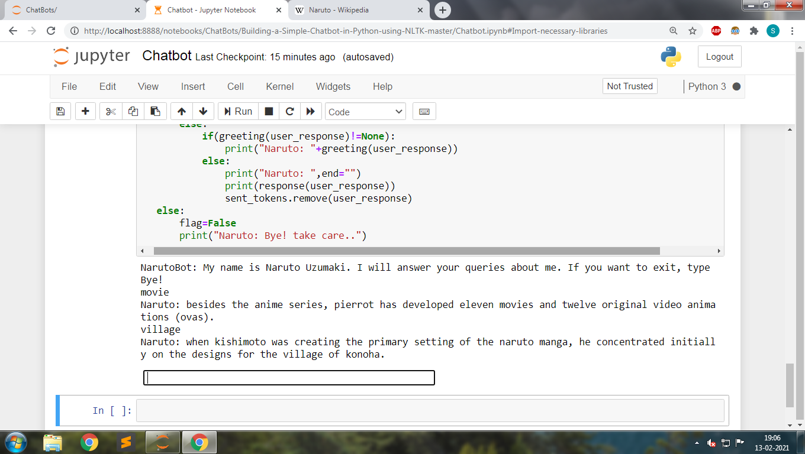

# NarutoBot
A Retrieval-based Chatbot which is provides you information about Naruto(Anime Character).

NLTK and BeautifulSoup4 library is used for extracting and tokenizing data from Wikipedia. TfidfVectorizer and cosine_similarity from sklearn library is used for selecting best responses.  

You can run the NarutoBot.ipynb through Jupyter Notebook  Terminal

